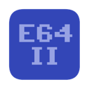

# E64-II

## Description
The E64-II (Enhanced 64-II) is a virtual computer system (under construction) that runs on macOS and linux. It's inspired by the Commodore 64 and the Amiga 500.
## Technical specifications:
* Motorola 68000 CPU running at 11.88MHz using the [Moira](https://github.com/dirkwhoffmann/Moira) library.
* A total of 16MB ram.
* A custom Video Interface Chip (VICV) with a resolution of 512x288 pixels and a palette of 4096 colors (12bit).
* A custom Blitter Chip with alpha blending capabilities.
* Two SID chips (MOS 6581) with stereo mixing possibilities. Each individual SID chip runs at 985248Hz for the same pitch as the original C64 pal version. Emulation is achieved with the excellent [reSID](http://www.zimmers.net/anonftp/pub/cbm/crossplatform/emulators/resid/index.html) library by Dag Lem. All combined 16 bit registers (lo/hi voice frequencies, pulse widths and filters) have been swapped to big endian format for interoperability with the Motorola 68000.
* Four independent and programmable timers with interrupt functionality.
## Screenshots
### Running (2020-05-28):

### Debugger (2020-07-15):

## Compiling
### Core application
#### macOS
* Install [Xcode](https://developer.apple.com/xcode)
* Install the [SDL2 framework](https://www.libsdl.org/download-2.0.php) development library to /Library/Frameworks
* Open the Xcode project in the ./macOS/E64 folder and build
#### Ubuntu Linux / Debian
Run the following commands in a terminal:
````console
$ sudo apt install build-essential cmake git libsdl2-dev
$ git clone https://github.com/elmerucr/E64-II
$ cd E64-II && mkdir build && cd build
$ cmake ..
$ make
````
Finally, to run the application from the build directory:
````console
$ ./E64-II
````
### Assembling the kernel ROM
The sourcecode comes with a working version of the kernel ````kernel.cpp````. If you want to build it yourself however, you can do the following:
* Make sure to have ````vasmm68k_mot```` installed on your system (see [vasm](http://sun.hasenbraten.de/vasm/)) and have it working from the command line.
* In the ````./src/devices/rom/kernel/```` directory, a ````Makefile```` can be found that makes use of ````vasmm68k_mot```` to assemble the ````*.asm```` sourcefiles into a binary rom image. Furthermore, a small ````bin2hex_64k```` utility will be built that converts this image into a c++ sourcefile (````kernel.cpp````) that's part of the larger E64-II project.
## Other websites and projects of interest
* [64tass](https://sourceforge.net/projects/tass64/) - An assembler for the legendary 6502 processor and its derivatives.
* [asmx multi-CPU assembler](http://xi6.com/projects/asmx/) - Excellent assembler with Motorola 680x0 support amongst others.
* [C256 Foenix](https://c256foenix.com) - A computer that could have possibly followed the Commodore 128 if things would have been different at Commodore at the time.
* [CCS64](http://www.ccs64.com) - A Commodore 64 Emulator by Per Håkan Sundell.
* [Commander X16](https://www.commanderx16.com) - The Commander X16 is a modern 8-bit computer currently in active development. It is the brainchild of David "the 8 Bit Guy" Murray.
* [Hatari](https://hatari.tuxfamily.org) - Hatari is an Atari ST/STE/TT/Falcon emulator.
* [lib65ce02](https://github.com/elmerucr/lib65ce02) - CSG65CE02 emulator written in C.
* [Mega65](http://mega65.org) - The 21st century realization of the C65 heritage.
* [Moira](https://github.com/dirkwhoffmann/Moira) - New Motorola 68000 emulator written in C++ by Dirk W. Hoffmann.
* [Musashi](https://github.com/kstenerud/Musashi) - Motorola 680x0 emulator written in C by Karl Stenerud.
* [reSID](http://www.zimmers.net/anonftp/pub/cbm/crossplatform/emulators/resid/index.html) - ReSID is a Commodore 6581 or 8580 Sound Interface Device emulator by Dag Lem.
* [SDL Simple DirectMedia Layer](https://www.libsdl.org) - A cross-platform development library by Sam Lantinga designed to provide low level access to audio, keyboard, mouse, joystick, and graphics hardware.
* [ultimate64](https://ultimate64.com/Ultimate-64) - A hardware implementation (FPGA) of the C64.
* [vAmiga](http://www.dirkwhoffmann.de/software/vAmiga.html) - An Amiga 500, 1000, or 2000 on your Apple Macintosh by Dirk W. Hoffmann.
* [vasm](http://sun.hasenbraten.de/vasm/) - A portable and retargetable assembler with very good support for the Motorola 680x0 family by Volker Barthelmann / Frank Wille.
* [VICE](http://vice-emu.sourceforge.net) - The Versatile Commodore Emulator.
* [VirtualC64](http://www.dirkwhoffmann.de/software/virtualC64.html) - A Commodore 64 on your Apple Macintosh by Dirk W. Hoffmann.
* [visual6502](http://www.visual6502.org) - Visual Transistor-level Simulation of the 6502 CPU and other chips.
## MIT License
Copyright (c) 2020 elmerucr

Permission is hereby granted, free of charge, to any person obtaining a copy of this software and associated documentation files (the "Software"), to deal in the Software without restriction, including without limitation the rights to use, copy, modify, merge, publish, distribute, sublicense, and/or sell copies of the Software, and to permit persons to whom the Software is furnished to do so, subject to the following conditions:

The above copyright notice and this permission notice shall be included in all copies or substantial portions of the Software.

THE SOFTWARE IS PROVIDED "AS IS", WITHOUT WARRANTY OF ANY KIND, EXPRESS OR IMPLIED, INCLUDING BUT NOT LIMITED TO THE WARRANTIES OF MERCHANTABILITY, FITNESS FOR A PARTICULAR PURPOSE AND NONINFRINGEMENT. IN NO EVENT SHALL THE AUTHORS OR COPYRIGHT HOLDERS BE LIABLE FOR ANY CLAIM, DAMAGES OR OTHER LIABILITY, WHETHER IN AN ACTION OF CONTRACT, TORT OR OTHERWISE, ARISING FROM, OUT OF OR IN CONNECTION WITH THE SOFTWARE OR THE USE OR OTHER DEALINGS IN THE
SOFTWARE.
