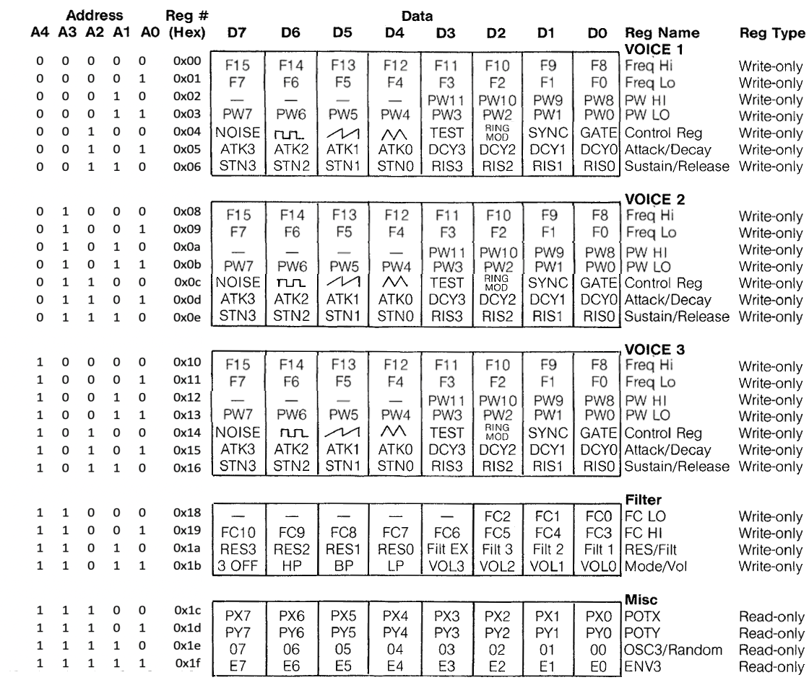

# Reference Manual
The E64-II (Enhanced 64-II) is a virtual computer system that runs on macOS and linux. It's inspired by the Commodore 64 and the Amiga 500.
* From the Commodore 64:
	* Look & feel (character set and colors)
	* The direct interface, turn on and have a command prompt ready
	* Two SID chips with capability to do stereo mixing
* From the Amiga 500:
	* The CPU: a Motorola 68000
	* A 12 bit color palette (4096 colors)
	* A large memory (16mb)
## Blitter
The blitter structure:

``...``

* Only when ``color_per_tile`` mode is off (0), the member ``foreground_color`` becomes effective.
## SIDS
In order to have the separate SID units work nicely with the Motorola 68000, the memory mapping of each SID unit has been adapted. First, the low and high bytes of the frequency and pulsewidth registers have been swapped to make it possible to write word values directly. Second, some padding bytes have been added (``0x07``, ``0x0f`` and ``0x17``) to allow word access at aligned addresses.

I/O area for the SIDS unit has been mapped from ``$fb0500`` to ``$fb05ff``.